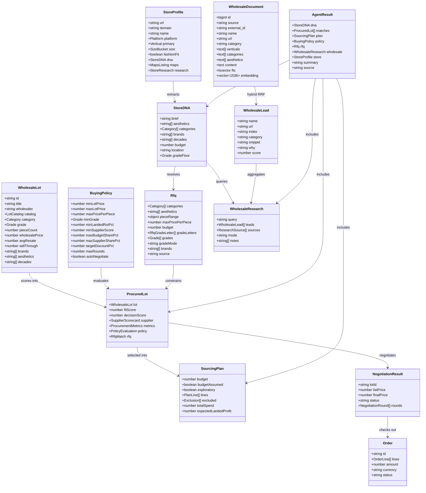

# LotPilot AI Wholesale Buying Agent for UK Indie Retailers

## Requirements
- Build an agentic wholesale procurement agent that turns a retailer's shop brief or storefront URL into a policy-compliant, negotiated opening buy
- Serve independent UK secondhand and vintage retailers who buy across many wholesalers, not one marketplace
- Keep ranking, policy, economics, and negotiation deterministic so demos run offline without paid API keys
- Use optional LLM only for narrative summary and optional RFQ parsing
- Surface UK wholesale directory leads via hybrid RAG (full-text + trigram + embeddings) with seeded and live fallbacks
- Deliver a hackathon-ready Agentic Commerce demo with chat, radar lot cards, deal room, and simulated checkout

## Entities


## Approach
1. Offline-first deterministic core:
   - Parse free-text brief into `StoreDNA` with keyword dictionaries
   - Score seeded catalogs (fashion 43 lots, electronics 8 lots) on aesthetic, category, brand, era, grade, budget
   - Enforce buying policy as rule evaluations with statuses compliant / negotiate / blocked
   - Build diversified sourcing plan under budget with supplier and category caps
   - Negotiate in rounds with market comps, early payment, and bundling levers; walk away above policy max
   - Optional LLM writes summary only; never owns ranking or prices

2. Storefront and directory intelligence:
   - Extract `StoreProfile` from live HTML, Shopify feeds, Maps, Tavily, or fixtures
   - Cache storefront analysis on disk and memory for 24h for deterministic replay
   - Research UK wholesale directories via Supabase hybrid RRF first (`wholesale_hybrid_search`)
   - Fall back to seeded `WHOLESALE_INDEX` and optional Tavily when RAG is unavailable
   - Skip Amazon Business scraping; treat directory RAG as the external supplier channel

3. Product and UX surface:
   - Next.js 14 App Router demo with chat brief, personas, RFQ editor, policy sidebar
   - Lot cards use a five-axis radar (Fit, Supplier, ROI, On-time, Decision) plus list/grid toggle
   - Collapse verbose Shop DNA under details; support system/light/dark theme
   - Deal modal plays negotiation transcript; checkout recomputes prices server-side

## Structure

### Inheritance Relationships
1. `ProcuredLot` extends `LotScore` with supplier, metrics, policy, and optional RFQ match
2. `FashionCategory` and `ElectronicsCategory` union into `Category`
3. No class inheritance hierarchy; TypeScript interfaces compose domain models
4. Postgres `wholesale_documents.fts` maintained by trigger `wholesale_documents_fts_refresh`

### Dependencies
1. `runAgent` / `runAgentForStore` call `parseBrief` or `extractStoreProfile`, then `resolveRfq`, `selectCandidates`, `buildSourcingPlan`, `researchWholesale`
2. `extractStoreProfile` depends on `fetcher`, `html`, `catalog`, `maps`, `research`, `classify`, `cache`
3. `researchWholesale` depends on `searchWholesaleRag` (Supabase RPC), `WHOLESALE_INDEX`, optional `tavilySearch`
4. `selectCandidates` depends on `matcher`, `rfq/score`, `procurement/policy`, `supplierScorecards`
5. API routes `/api/chat`, `/api/store`, `/api/negotiate`, `/api/checkout` call agent, store, negotiation, checkout libs
6. UI `ChatPanel` renders `LotCard` / `MatchesPanel`, `StoreProfileCard`, `WholesaleResearchCard`, `SourcingPlanCard`, `DealModal`

### Layered Architecture
1. Presentation Layer: `src/app/*`, `src/components/*` — landing, demo chat, cards, theme toggle
2. API Layer: `src/app/api/*/route.ts` — JSON POST endpoints, force-dynamic node runtime
3. Agent Orchestration Layer: `src/lib/agent.ts` — DNA → RFQ → candidates → plan → wholesale → summary
4. Domain Services: `matcher`, `procurement/*`, `rfq/*`, `store/*`, `wholesale/*`, `checkout`, `llm`
5. Data Layer: `src/data/*` fixtures (lots, suppliers, personas, wholesaleIndex) plus Supabase `wholesale_documents`
6. Cache Layer: `.cache/store-profiles/`, `.cache/wholesale-research/` memory + disk TTL envelopes

## Operations

### Create Agent Orchestrator - runAgent / runAgentForStore / runAgentFromDna
1. Responsibility: Run one end-to-end buy from brief or store URL under a buying policy
2. Attributes:
   - DEFAULT_BUDGET: number — 2000 GBP when brief omits budget
3. Methods:
   - runAgent(brief, policyInput?, opts?): Promise<AgentResult>
     - Logic:
       - parseBrief(brief) → StoreDNA
       - resolvePersonaId from brief or opts
       - delegate to runAgentFromDna with refresh flag
   - runAgentForStore(storeUrl, policyInput?, opts?): Promise<AgentResult>
     - Logic:
       - extractStoreProfile(storeUrl, { refresh })
       - override DNA budget with size.suggestedBudget
       - delegate to runAgentFromDna with store attached
   - runAgentFromDna(dna, policyInput?, store?, opts?): Promise<AgentResult>
     - Logic:
       - sanitizePolicy(policyInput)
       - resolveRfq(dna, optional llmParse when keyed and no store)
       - budget = rfq.budget ?? dna.budget ?? DEFAULT_BUDGET
       - resolveCatalog(store) → fashion | electronics
       - selectCandidates → buildSourcingPlan (exploratory £500 / max 2 lines for weak non-fashion)
       - rankProcured(candidates).slice(0, 6)
       - researchWholesale(dna, store, { refresh })
       - summary via generateLlmSummary if available else buildSummary
4. Constraints: Ranking, policy, economics, negotiation remain deterministic regardless of LLM keys

### Create Store Extraction - extractStoreProfile
1. Responsibility: Build StoreProfile and StoreDNA from a public storefront URL
2. Methods:
   - extractStoreProfile(url, { refresh? }): Promise<StoreProfile>
     - Logic:
       - normalizeUrl; reject private/local hosts
       - readStoreCache unless refresh
       - fetch live HTML (6s, 1.5MB) else fixture else offline notes
       - parse SEO, JSON-LD, collections/products feeds
       - resolve Maps via Places → Tavily → fixture → JSON-LD
       - optional Tavily research into classifier text
       - classify vertical and size bucket; set suggestedBudget
       - writeStoreCache; return profile with fetch.cached metadata
3. Dependencies: fetcher, html, catalog, maps, research, classify, cache
4. Constraints: Failures degrade source-by-source; fixtures keep offline demos working

### Create Storefront Cache - store/cache
1. Responsibility: Deterministic 24h replay of storefront analysis
2. Attributes:
   - STORE_CACHE_VERSION: 1
   - DEFAULT_TTL_MS: env STORE_CACHE_TTL_MS or 24h
3. Methods:
   - storeCacheKey(url): string — host without www + normalized path
   - readStoreCache(key): Promise<StoreProfile | null>
   - writeStoreCache(key, profile, ttlMs?): Promise<StoreProfile>
4. Constraints: Memory Map plus `.cache/store-profiles/`; ignore disk errors on read-only FS

### Create Wholesale RAG Search - searchWholesaleRag
1. Responsibility: Hybrid RRF retrieval over Supabase wholesale_documents
2. Methods:
   - ragAvailable(): boolean — NEXT_PUBLIC_SUPABASE_URL + ANON_KEY set
   - searchWholesaleRag(query, matchCount=6): Promise<{ hits, model } | null>
     - Logic:
       - embed query with local-hash-v1 (default) or OpenAI when WHOLESALE_EMBED_MODEL=openai
       - rpc wholesale_hybrid_search(query_text, query_embedding, match_count, weights, rrf_k=60)
       - return ranked HybridHit rows with rank_fts, rank_trgm, rank_semantic, rrf_score
   - leadsFromHits(hits): WholesaleLead[] — map scores via rrf_score * 2500 capped 1..100
3. Dependencies: getSupabase, hashEmbed / embedQuery
4. Constraints: Query embedding model must match ingest model

### Create Wholesale Research - researchWholesale
1. Responsibility: Produce WholesaleResearch leads for the agent run
2. Methods:
   - buildWholesaleQuery(dna, store?): string
   - matchWholesaleIndex(dna, vertical?): WholesaleLead[] — seeded score ≥ 20, top 6
   - researchWholesale(dna, store?, { refresh? }): Promise<WholesaleResearch>
     - Logic:
       - cache key from sorted aesthetics/categories/brands/vertical/location
       - if usedRag via searchWholesaleRag → mode "rag", skip Tavily
       - else seeded index, then optional Tavily site:thewholesaler.co.uk → mode live|mixed
       - canonicalUrl preserves ?id= on go.cgi supplier URLs
       - write cache version 2 under `.cache/wholesale-research/`
3. Constraints: MAX_LEADS = 6; Amazon Business out of scope

### Create Postgres Hybrid Search - wholesale_hybrid_search
1. Responsibility: Fuse FTS, trigram, and embedding ranks with RRF in Postgres
2. Table: wholesale_documents (source, external_id, name, url, category, verticals, categories, aesthetics, content, fts, embedding vector(1536))
3. Function parameters: query_text, query_embedding, match_count, full_text_weight, trigram_weight, semantic_weight, rrf_k
4. Logic:
   - full_text CTE: websearch_to_tsquery + ts_rank_cd
   - trigram CTE: similarity / % on name and content
   - semantic CTE: embedding <=> query when both non-null
   - FULL OUTER JOIN; score = Σ weight / (k + rank); limit match_count
5. Security: RLS public SELECT for anon/authenticated; SET search_path on functions
6. Ingest: scripts/ingest-wholesale.mjs crawls The Wholesaler UK categories and upserts with hash embeddings

### Create Matcher and RFQ Pipeline - matcher / rfq/*
1. Responsibility: Score catalog lots for DNA vibe and RFQ constraints
2. Methods:
   - parseBrief → StoreDNA
   - resolveRfq merges DNA, deterministic parse, optional LLM parse, UI override
   - scoreRfq / selectCandidates blend RFQ relevance with vibe fit and policy
   - hard RFQ misses exclude from plan gate
3. Constraints: Grade letters A/B/C map to catalog grades A, AB, B, Mixed

### Create Procurement Engine - procurement/*
1. Responsibility: Policy evaluation, metrics, sourcing plan, negotiation
2. Methods:
   - sanitizePolicy / evaluatePolicy → PolicyEvaluation
   - build metrics: priceIndex, landedCost, landedRoiPct, riskLevel, decisionScore
   - buildSourcingPlan under budget with supplierShare and category caps
   - negotiateLot rounds until agreed or walked-away
3. Constraints: Server checkout recomputes negotiated prices; client cannot set final price

### Create UI Surfaces - ChatPanel, LotCard, MatchesPanel, WholesaleResearchCard
1. Responsibility: Demo experience for brief → matches → plan → deal → checkout
2. Components:
   - LotCard layout grid|list with RadarChart axes Fit, Supplier, ROI, On-time, Decision
   - MatchesPanel persists layout in localStorage key lotpilot-matches-layout
   - StoreProfileCard collapses DNA evidence under details
   - WholesaleResearchCard shows mode Hybrid RAG | Directory index | Live | mixed
   - ThemeToggle cycles system | light | dark via themeBootScript (no FOUC)
3. Constraints: Unslopped copy; retailer-centric wording; no Fleek product branding in UI

### Create API Routes - /api/chat|/store|/negotiate|/checkout
1. Responsibility: JSON APIs for demo flows
2. Methods:
   - POST /api/chat — brief or storeUrl; forwards refresh, rfq, personaId, policy
   - POST /api/store — extractStoreProfile with refresh
   - POST /api/negotiate — negotiation transcript for selected lots
   - POST /api/checkout — server-side Order with recomputed prices
3. Constraints: runtime nodejs; dynamic force-dynamic; validate public URLs

## Norms
1. Language and modules: TypeScript functional style; prefer interfaces over classes; path alias `@/`
2. Determinism first: numbers, ranking, policy, negotiation never depend on LLM output
3. Offline-first: every demo path works with no env keys; keys only enrich
4. Caching: SHA-keyed JSON envelopes with version + TTL; memory then disk
5. Copy: Simplified Technical English; no em dashes, chatbot filler, or mannered prose (/unslop)
6. Theming: CSS variables for ink/paper/brand; system preference default; boot script before paint
7. Security: block private hosts on fetch; never expose service_role to browser; RLS on public tables
8. Embeddings: local-hash-v1 by default for offline parity; OpenAI only after re-ingest with WHOLESALE_EMBED_MODEL=openai
9. Error handling: degrade per source; return friendly API errors without stack traces to client
10. Naming: wholesale RAG files under `src/lib/wholesale/`; store extraction under `src/lib/store/`; fixtures under `src/data/`

## Safeguards
1. Functional Constraints:
   - Must produce AgentResult with dna, matches (≤6), plan, policy, rfq, summary
   - Must never let LLM change lot prices, policy verdicts, or negotiation walk-away
   - Must support fashion and electronics catalogs without cross-contamination for known verticals
2. Performance Constraints:
   - Store fetch timeout 6s and body cap 1.5MB
   - Wholesale hybrid search match_count capped at 30 in SQL; app uses 6 leads
   - Cache hits should skip live network for storefront and wholesale research
3. Security Constraints:
   - Reject localhost and private IP store URLs
   - Anon key read-only for wholesale_documents; ingest uses service role or temporary write policy
   - Checkout ignores client-supplied final prices
4. Integration Constraints:
   - Supabase project lmfvzuvhwvjpdfkoqqvc; Amazon Business scraping excluded
   - Tavily includeDomains limited to thewholesaler.co.uk for wholesale live search
   - Optional OpenAI/Anthropic for summary and RFQ parse only
5. Business Rule Constraints:
   - Policy walk-away is hard; negotiation cannot exceed maxAcceptablePrice
   - Exploratory non-fashion (non-electronics) plans capped at £500 and 2 lines
   - Seeded wholesale index score threshold ≥ 20 before listing
6. Data Constraints:
   - Currency GBP throughout
   - Embedding dimension fixed at 1536
   - Preserve go.cgi?id= query on The Wholesaler supplier URLs during dedupe
7. API Constraints:
   - /api/chat requires brief or valid storeUrl
   - refresh boolean must propagate for brief and store paths
   - Order status always confirmed mock or Commerce Layer when configured
8. UX Constraints:
   - First-class radar visualization replaces dense metric tables on lot cards
   - Shop DNA verbosity hidden under details by default
   - Theme preference persisted; system is default
```

